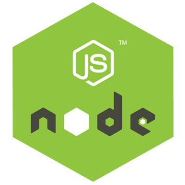

# Node

Ambiente de trabajo de Node, se usa dentro de un container usando *visualcode* o una aplicación similar.

---

## Uso

Requisitos:

* Docker y docker-compose instalados

### Visual Studio Code

Requisitos:

* La extension `ms-vscode-remote.remote-containers`

Instrucciones

1) Copiarse el archivo `docker-compose.yaml` y la carpeta `.devcontainer` a tu proyecto.
2) Instalar la extension `ms-vscode-remote.remote-containers` si no la tenes.
3) Desde el *vscode* usar la extension de `remote-containers` para iniciar el contenedor.

---

## Puertos

* **app**: 8080

## Volumes

* **$PWD**: el código de tu proyecto

---

## Paginas

* [Docker Hub node](https://hub.docker.com/_/node)
