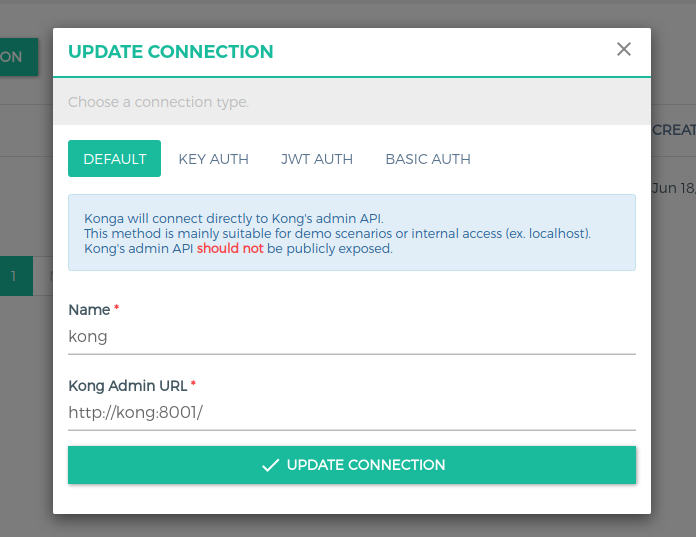

# Kong

> Imagen de kong y konga

## Puertos

* **kong**: 8080
* **konga**: 1337

## Instrucciones

Para que funcione es necesario ir a [konga url](https://localhost:1337) a la parte de connections e ingresar una nueva con la url de kong que es **http://kong:8001/**  (se debe ingresar con http;// porque sino no lo toma)

Luego se debe hacer click en **ACTIVATE**
## Paginas

[Imagen docker hub kong](https://hub.docker.com/_/kong/)
[Imagen docker hub konga](https://hub.docker.com/r/pantsel/konga/)
