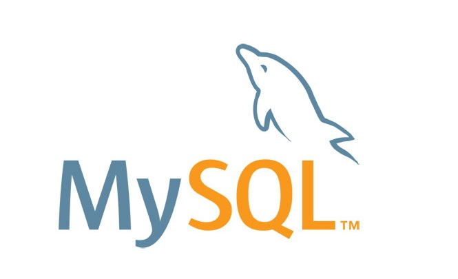

# MySQL SERVER

## ACCESOS

* **user**: admin
* **pass**: admin
* **puerto**: 3306
* **BD de ejemplo**: database
* **user root**: root
* **pass root**: admin

## Volumes

* **data**: con los datos guardados por la base de datos
* **sql**: sirve para agregar scripts sql

## Paginas

https://hub.docker.com/_/mysql
