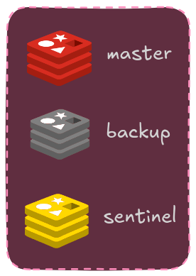
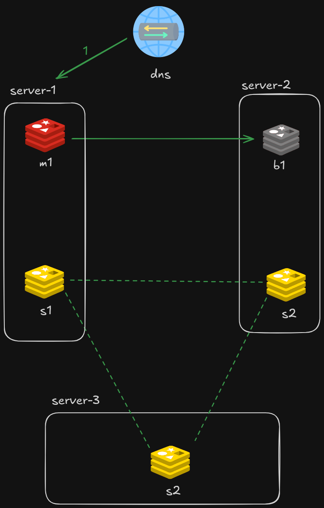
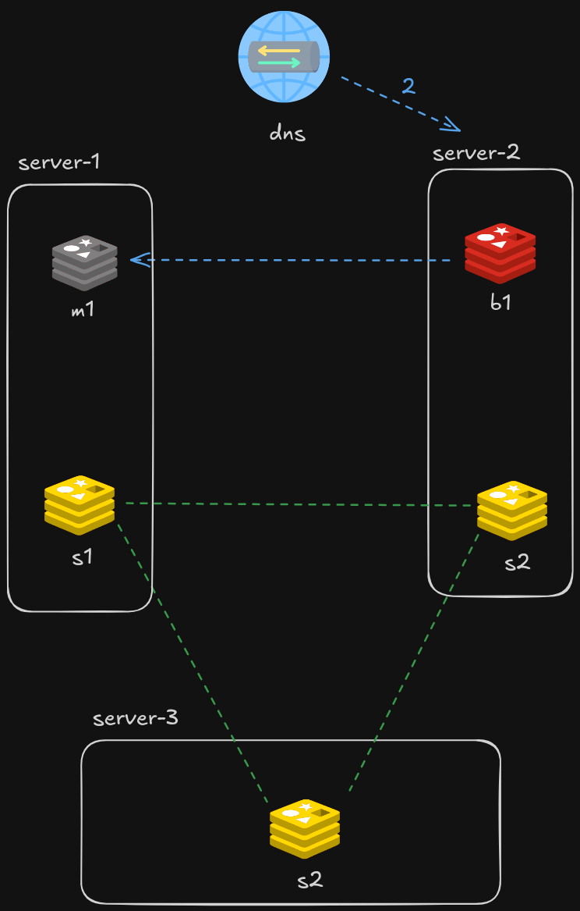

# Ejemplo Redis con fail over

Ejemplo de Redis con backup y restauracion

## Diagramas



### Funcionamiento normal



### Funcionamiento ante caida del server-1



## Uso

### Local con Docker compose

Instruccines

1) levantar todo con docker

    ```sh
    make up
    ```

2) Ir a [link de Dozzle](https://localhost:8080) para ver si todo funciona

3) Cargar algunas claves en Redis

4) Destruir server 1

    ```sh
    make boom-1
    ```

5) Se tuvo que haber activado el fail-over

6) Probar cargar nuevas claves, ahora el b1 se volvio master

7) Restaurar server 1

    ```sh
    make restore-1
    ```

8) Revisar que las claves nuevas esten en el m1, pero no va a dejar agregar nuevas porque ahora es un backup

9) Correr lo siguiente en cualquier sentinel para volver a cambiar los masters

    ```sh
    redis-cli -p 5001 -a redis SENTINEL FAILOVER server1
    ```

10) Verificar que ahora se puede volver a escribir en el m1 porque volvio a ser master

11) Bajar la prueba con

    ```sh
    make down
    ```
