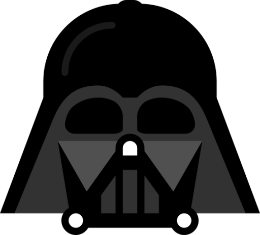
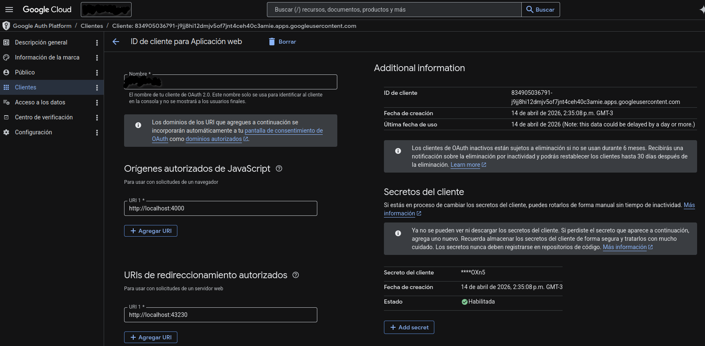

# DartVader

Repositorio self-hosted para almacenar librerias de Dart



## Levantar con Docker Compose

Desde `repositorios/dartvader`:

```bash
docker compose up -d --build
```

Servicios levantados:

- `mongo`: base de datos MongoDB.
- `dartvader`: servidor privado de paquetes en `http://localhost:4000`.

Parar y borrar contenedores:

```bash
docker compose down
```

## Subir una dependencia

### Requisitos

- dart 3
- docker
- docker compose

### Instrucciones

1) Generar un token de Google oauth2 - [Link de como hacerlo](https://developers.google.com/identity/protocols/oauth2)

    - Dentro de Google cloud hay que crear un proyecto, crear una aplicacion y recien despues se crea el client id y client secret

    - Luego de eso hay que habilitar redirects uris y origin para que la aplicacion pueda funcionar

    

2) Exportar las variables

    ```bash
    export GOOGLE_CLIENT_ID=<client_id>
    export GOOGLE_CLIENT_SECRET=<client_secret>
    ```

3) Loguearse en dartVader

    ```bash
    make login
    ```

4) Generar un toked de dartVader para el comando `dart pub token`

    ```bash
    make token
    ```

5) Configurar el archivo `pubspec.yaml` en el repo con la libreria a subir

    ```bash
    name: your_package
    version: 1.0.0
    publish_to: http://localhost:4000/
    ```

6) Subir la libreria

    En el repo de la libreria ejecutar

    ```bash
    dart pub token add http://localhost:4000/
    # luego ingresar el token

    dart pub publish
    ```
