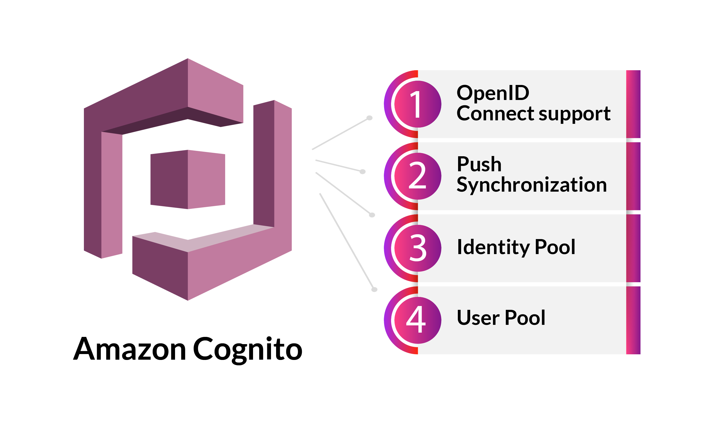

# Cognito

> Imagen de Cognito



## Puertos

* **server**: 9229

## Uso

```bash
aws --endpoint http://localhost:9229 cognito-idp create-user-pool --pool-name MyUserPool
```

## Paginas

[Docker](https://registry.hub.docker.com/r/jagregory/cognito-local)
[Repo](https://github.com/jagregory/cognito-local)
