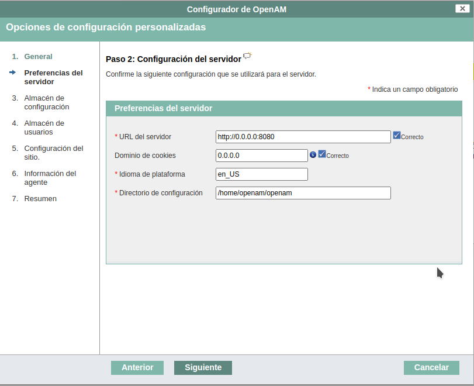

# Droppy

> Imagen de openAM

## Instalacion

1. Seleccionar la instalacion personalizada
2. Configurar la url cambiando **localhost** por **0.0.0.0** tal cual queda en la siguiente imagen:
    
3. Las demas opciones hacerlas a gusto

## Puertos

* **server**: 8080

## ACCESOS

* **URL**: http://0.0.0.0:8080/openam
* **USER**: amadmin
* **PASS**: *la que configuraste*

## Volumes

* **openam**: configuracion de openam

## Paginas

[Docker](https://hub.docker.com/r/openidentityplatform/openam/)

**Docs**:

https://github.com/OpenIdentityPlatform/OpenAM

https://www.openidentityplatform.org/blog/openam-quick-start-guide

https://backstage.forgerock.com/knowledge/kb/article/a69972604#console
