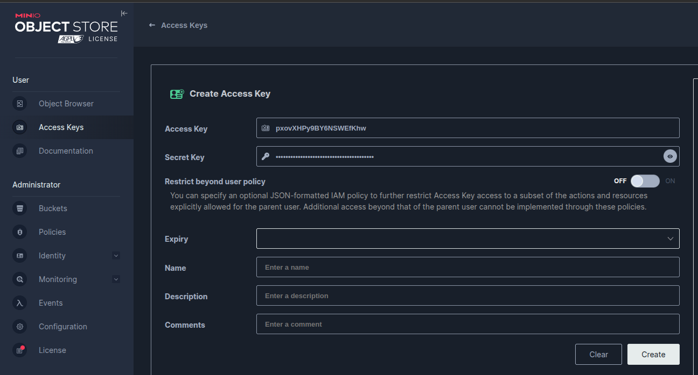

# Minio

> Imagen de Minio, un servidor de objetos para guardar archivos


## Consola

* [Consola WEB](http://127.0.0.1:9001/)

## ACCESOS

**USER**: adminminion
**PASS**: adminminion

## Volumes

* **data**: con los datos de la aplicacion
* **storage**: archivos guardados

## Prueba

1) Crear un key y secret

    

2) Ejecutar lo siguiente para hacer una prueba

    ```bash
    URL=http://172.18.0.2:9000 && \
    BUCKET=lasegunda && \
    KEY=ejemplo && \
    FILE=README.md && \
    export AWS_ACCESS_KEY_ID=VYgqiusmv3B5QQJuJxbI && \
    export AWS_SECRET_ACCESS_KEY=vHm06w8zQgJC0US1fh0nSUeukPb8ne28dFCiBhAK && \
    aws --endpoint-url $URL s3api put-object \
        --bucket $BUCKET \
        --key $KEY \
        --body $FILE
    ```

## Paginas

[Imagen docker hub](https://hub.docker.com/r/minio/minio/)
